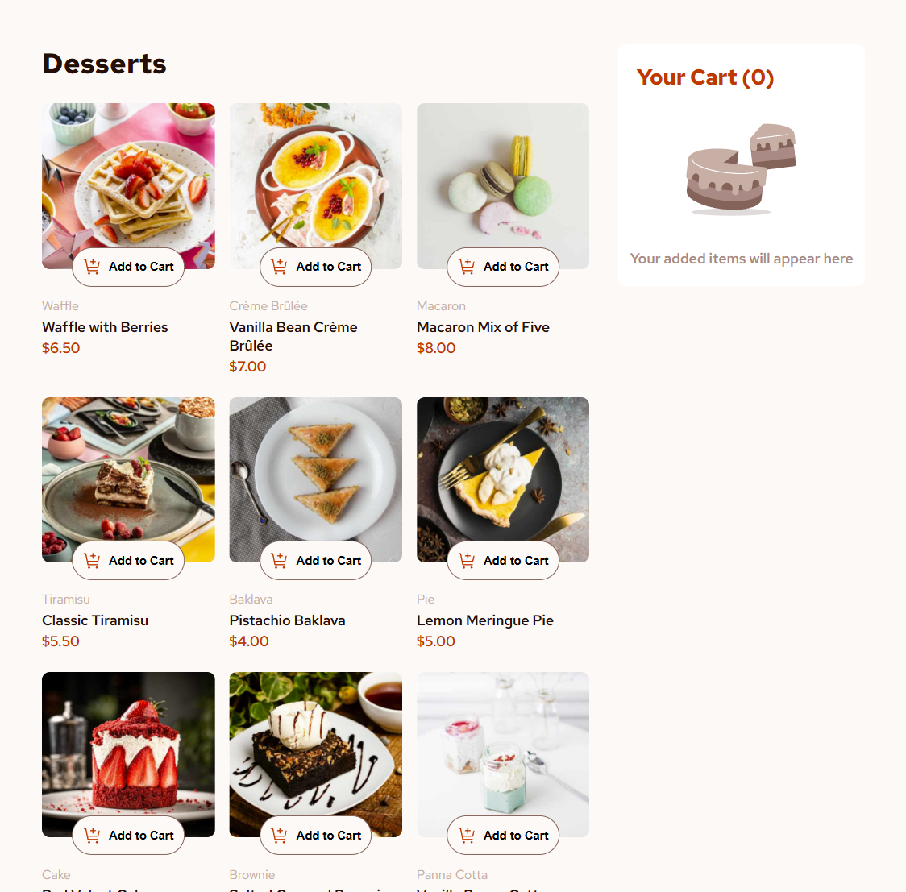
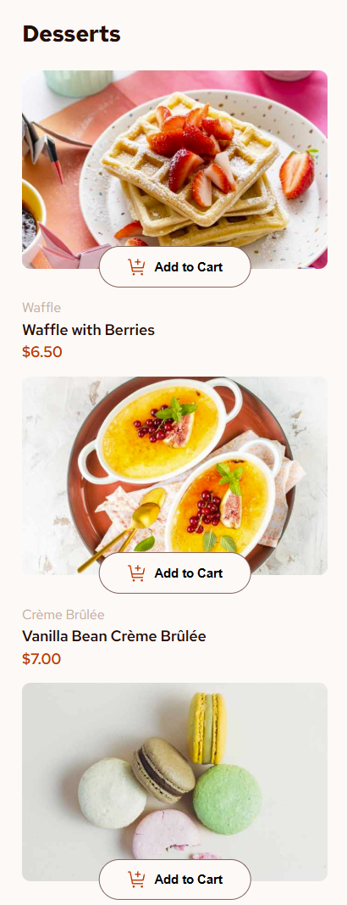

# Frontend Mentor - Product list with cart solution

This is a solution to the [Product list with cart challenge on Frontend Mentor](https://www.frontendmentor.io/challenges/product-list-with-cart-5MmqLVAp_d). Frontend Mentor challenges help you improve your coding skills by building realistic projects. 

## Table of contents

- [Overview](#overview)
  - [The challenge](#the-challenge)
  - [Screenshot](#screenshot)
  - [Links](#links)
- [My process](#my-process)
  - [Built with](#built-with)
  - [What I learned](#what-i-learned)
  - [Continued development](#continued-development)
  - [Useful resources](#useful-resources)
- [Author](#author)
- [Acknowledgments](#acknowledgments)

## Overview

### The challenge

Users should be able to:

- Add items to the cart and remove them
- Increase/decrease the number of items in the cart
- See an order confirmation modal when they click "Confirm Order"
- Reset their selections when they click "Start New Order"
- View the optimal layout for the interface depending on their device's screen size
- See hover and focus states for all interactive elements on the page

### Screenshot





### Links

- Solution URL: [Add solution URL here](https://github.com/anglyh/product-list)
- Live Site URL: [Add live site URL here](https://product-list-mpq9.onrender.com)

## My process

### Built with

- Semantic HTML5 markup
- CSS custom properties
- Flexbox
- CSS Grid
- Mobile-first workflow


### What I learned

While working on this project, I learned how to manage state in a vanilla JavaScript application without relying on a framework. I also gained experience in dynamically updating the DOM based on user interactions and handling asynchronous data fetching.

Here are some code snippets that I'm particularly proud of:

```javascript
// Fetching data from a local JSON file
export const fetchData = async () => {
  const response = await fetch('../data.json');
  return response.json();
};

// Managing the shopping cart state
const updateSelectedProducts = (productItem) => {
  const elements = getProductElements(productItem);
  const quantity = elements.quantityValue.textContent;
  
  selectedProducts[elements.details.name] = createProductObject(
    elements.details,
    quantity
  );
};
```

### Continued development

In future projects, I plan to explore more advanced state management techniques and possibly integrate a lightweight framework or library to handle more complex interactions. I also want to improve my skills in responsive design and accessibility.

### Useful resources

- [MDN Web Docs](https://developer.mozilla.org/) - This is an invaluable resource for understanding web standards, JavaScript, and DOM manipulation. I frequently used it to look up methods like fetch, classList, and event handling.

## Author

<!-- - Website - [Angel Yaguno](https://www.your-site.com) -->
- Frontend Mentor - [@anglyh](https://www.frontendmentor.io/profile/yourusername)

## Acknowledgments

I would like to thank the Frontend Mentor community for providing this challenge and the opportunity to improve my skills.
